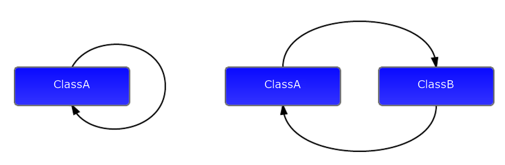

<!-- .slide: data-background="#111111" -->

# Metody obsługi błędów

___

## `goto`

```cpp
#include <iostream>

bool isValid() { /* ... */ }

int main() {
    // ...
    if(!isValid()) {
        goto error;
    }

error:
    std::cerr << "Error occured" << '\n';
    return 1;
}
```

___

## `errno`

W programowaniu w C/C++ jest też koncepcja `errno`, czyli statycznej współdzielonej zmiennej, którą ustawia się na odpowiednią wartość w przypadku wystąpienia błędu. Zobacz [`errno` na cppreference](https://en.cppreference.com/w/cpp/error/errno).

```cpp
int main() {
    double not_a_number = std::log(-1.0);
    std::cout << not_a_number << '\n';
    if (errno == EDOM) {
        std::cout << "log(-1) failed: " << std::strerror(errno) << '\n';
        std::setlocale(LC_MESSAGES, "de_DE.utf8");
        std::cout << "Or, in German, " << std::strerror(errno) << '\n';
    }
}
```

___

## Kody powrotu / kody błędów

```cpp
#include <iostream>

enum class ErrorCode { Ok, FailCause1, FailCause2 };
bool isValid() { /* ... */ }

ErrorCode foo() {
    if(!isValid()) {
        return ErrorCode::FailCause1;
    }
    // ...
    return ErrorCode::Ok;
}

int main() {
    if(foo() == ErrorCode::FailCause1) {
        std::cerr << "Error occured" << '\n';
        return 1;
    }
    return 0;
}
```

___
<!-- .slide: style="font-size: 0.9em" -->

### Obsługa błędów w konstruktorach i operatorach

Konstruktory i operatory mają ściśle zdefiniowane typy zwracane (lub ich brak). Niemożliwe jest zwrócenie w nich własnego kodu powrotu.

```cpp
struct FileWrapper {
    FileWrapper(std::string const& filePath)
            : m_file(fopen(filePath.c_str(), "rw")) {
        /* What if the file did not open? */
    }

    ~FileWrapper() {
        fclose(m_file);
    }

    FileWrapper & operator<<(std::string const& text) {
        /* What if the file did not open? */
        fputs(text.c_str(), m_file);
        return *this;
    }

private:
    FILE* m_file;
};
```

___
<!-- .slide: style="font-size: 0.85em" -->

## `throw`

Zamiast zwracać specjalną wartość z funkcji lub ustawiać globalną zmienną po prostu rzucamy wyjątkiem. To wskazuje, że coś poszło nie tak, a błąd możemy obsłużyć w zupełnie innym miejscu.

```cpp
struct FileWrapper {
    FileWrapper(std::string const& filePath)
            : m_file(fopen(filePath.c_str(), "rw")) {
        if(!m_file) {
            throw std::runtime_error("File not opened");
        }
    }

    ~FileWrapper() {
        fclose(m_file);
    }

    FileWrapper & operator<<(std::string const& text) {
        /* Not validation needed, invalid object cannot be created */
        fputs(text.c_str(), m_file);
        return *this;
    }

private:
    FILE* m_file;
};
```

___
<!-- .slide: style="font-size: 0.85em" -->

## `try/catch`

Za pomocą `try` oznaczamy blok kodu, w którym możliwe jest rzucenie wyjątku. Bloki `catch` służą do łapania wyjątków określonych typów.

<div class="multicolumn" style="position: relative">
<div class="col" style="width: 75%; flex: none">

```cpp
#include <iostream>
#include <stdexcept>

void foo() { throw std::runtime_error("Error"); }

int main() {
    try {
        foo();
    } catch(std::runtime_error const&) {
        std::cout << "std::runtime_error" << std::endl;
    } catch(std::exception const& ex) {
        std::cout << "std::exception: " << ex.what() << std::endl;
    } catch(...) {
        std::cerr << "unknown exception" << std::endl;
    }
}
```

</div>
<div class="col fragment fade-in">

### Result

`std::runtime_error`

</div>
</div>

___

## Co to jest wyjątek?

W ogólności - dowolny obiekt. Każdy obiekt może być wyjątkiem.
<!-- .element: class="fragment fade-in" -->

```cpp
throw 42;
```
<!-- .element: class="fragment fade-in" -->

Nie jest rekomendowane używanie wbudowanych typów lub tworzonych klas jako wyjątki.
<!-- .element: class="fragment fade-in" -->

```cpp
throw std::runtime_error{"Huston, we have a problem"};
```
<!-- .element: class="fragment fade-in" -->

Poleca się, aby wyjątki były specjalnymi klasami, które dziedziczą po innych klasach wyjątków z biblioteki standardowej. Przykładem może być `std::runtime_error`, który dziedziczy po `std::exception`.
<!-- .element: class="fragment fade-in" -->
<!-- .slide: data-background="#111111" -->

# Jak to działa?

___
<!-- .slide: style="font-size: 0.9em" -->

## Dopasowanie typu wyjątku

<div class="multicolumn" style="position: relative">
<div class="col" style="width: 75%; flex: none">

```cpp
struct TalkingObject {
    TalkingObject()  { cout << "Constructor" << '\n'; }
    ~TalkingObject() { cout << "Destructor" << '\n'; }
};

void foo() { throw std::runtime_error("Error"); }

int main() {
    TalkingObject outside;
    try {
        TalkingObject inside;
        foo();
    } catch(runtime_error const& ex) {
        cout << "runtime_error: " << ex.what() << '\n';
    } catch(exception const&) {
        cout << "exception" << '\n';
    }
}
```

</div>
<div class="col fragment fade-in">

### Wynik

`Constructor` <!-- .element: class="fragment fade-in" -->

`Constructor` <!-- .element: class="fragment fade-in" -->

`Destructor` <!-- .element: class="fragment fade-in" -->

`runtime_error: Error` <!-- .element: class="fragment fade-in" -->

`Destructor` <!-- .element: class="fragment fade-in" -->

</div>
</div>

___

## Mechanizm odwijania stosu

* <!-- .element: class="fragment fade-in" --> Rzucony wyjątek startuje mechanizm odwijania stosu (stack unwinding mechanism)
* <!-- .element: class="fragment fade-in" --> Typ wyjątku jest dopasowywany do kolejnych klauzul <code>catch</code>
* <!-- .element: class="fragment fade-in" --> Wyjątek jest polimorficzny, tzn. może zostać dopasowany do typu klasy bazowej
* <!-- .element: class="fragment fade-in" --> Jeśli typ pasuje:
  * <!-- .element: class="fragment fade-in" --> Wszystko zaalokowane na stosie jest niszczone w odwrotnej kolejności aż do napotkania bloku <code>try</code>
  * <!-- .element: class="fragment fade-in" --> Kod z pasującej klauzuli <code>catch</code> jest wykonywany
  * <!-- .element: class="fragment fade-in" --> Obiekt wyjątku jest niszczony
* <!-- .element: class="fragment fade-in" --> Jeśli typ nie pasuje do żadnej klauzuli <code>catch</code>, odwijanie stosu jest kontynuowane do kolejnego bloku <code>try</code>

___
<!-- .slide: style="font-size: 0.9em" -->

## Nieobsłużony wyjątek

<div class="multicolumn" style="position: relative">
<div class="col" style="width: 75%; flex: none">

```cpp
struct TalkingObject { /*...*/ };

void foo() { throw std::runtime_error("Error"); }

void bar() {
    try {
        TalkingObject inside;
        foo();
    } catch(std::logic_error const&) {
        std::cout << "std::logic_error" << '\n';
    }
}

int main() {
    TalkingObject outside;
    bar();
}
```

</div>
<div class="col fragment fade-in">

### Wynik

`Constructor` <!-- .element: class="fragment fade-in" -->

`Constructor` <!-- .element: class="fragment fade-in" -->

`>> abort() <<` <!-- .element: class="fragment fade-in" -->

</div>
</div>

___

## Czemu destruktory nie zostały wywołane?

* <!-- .element: class="fragment fade-in" --> Mechanizm odwijania stosu najpierw sprawdza, czy w obecnym bloku <code>try</code> jest pasująca klauzula <code>catch</code> jeszcze przed zniszczeniem obiektów
* <!-- .element: class="fragment fade-in" --> Wyjątek który nie został przechwycony i wypada po funkcję main powoduje zawołanie <code>std::terminate()</code>, które ubija program.

___
<!-- .slide: style="font-size: 0.9em" -->

## Ponowne rzucanie wyjątków

<div class="multicolumn" style="position: relative">
<div class="col" style="width: 75%; flex: none">

```cpp
struct TalkingObject { /*...*/ };

void foo() { throw std::runtime_error("Error"); }

void bar() try {
    TalkingObject inside;
    foo();
} catch(std::exception const&) {
    std::cout << "exception" << '\n';
    throw;
}

int main() {
    TalkingObject outside;
    try {
        bar();
    } catch(std::runtime_error const& ex) {
        std::cout << "runtime_error: " << ex.what() << '\n';
    }
}
```

</div>
<div class="col fragment fade-in">

Samo `throw` w bloku `catch` powoduje ponowne rzucenie aktualnego wyjątku.

### Wynik <!-- .element: class="fragment fade-in" -->

`Constructor` <!-- .element: class="fragment fade-in" -->

`Constructor` <!-- .element: class="fragment fade-in" -->

`Destructor` <!-- .element: class="fragment fade-in" -->

`exception` <!-- .element: class="fragment fade-in" -->

`runtime_error: Error` <!-- .element: class="fragment fade-in" -->

`Destructor` <!-- .element: class="fragment fade-in" -->

</div>
</div>

___

## Ponowne rzucanie wyjątku

* <!-- .element: class="fragment fade-in" --> Wyjątek rzucony ponownie raz jeszcze uruchamia mechanizm odwijania stosu
* <!-- .element: class="fragment fade-in" --> Odwijanie stosu jest kontynuowane do kolejnego bloku <code>try</code>
* <!-- .element: class="fragment fade-in" --> Klauzula <code>catch</code> dla typu bazowego przechwyci też wyjątki typów pochodnych
* <!-- .element: class="fragment fade-in" --> Ponowne rzucenie wyjątki nie zmienia oryginalnego typu wyjątku

___
<!-- .slide: style="font-size: 0.9em" -->

## Rzucenie wyjątku podczas odwijania stosu

<div class="multicolumn" style="position: relative">
<div class="col" style="width: 75%; flex: none">

```cpp
struct TalkingObject { /*...*/ };
struct ThrowingObject {
    ThrowingObject() { std::cout << "Throwing c-tor\n"; }
    ~ThrowingObject() {
        throw std::runtime_error("error in destructor");
    }
};

void foo() { throw std::runtime_error("Error"); }

int main() {
    TalkingObject outside;
    try {
        ThrowingObject inside;
        foo();
    } catch(std::exception const&) {
        std::cout << "std::exception" << '\n';
        throw;
    }
}
```

</div>
<div class="col fragment fade-in">

### Wynik

`Constructor` <!-- .element: class="fragment fade-in" -->

`Throwing c-tor` <!-- .element: class="fragment fade-in" -->

`>> abort() <<`  <!-- .element: class="fragment fade-in" -->

</div>
</div>

___

## Wnioski

* <!-- .element: class="fragment fade-in" --> Można obsługiwać tylko jeden wyjątek na raz
* <!-- .element: class="fragment fade-in" --> Wyjątek rzucony podczas odwijania stosu powoduje ubicie programu - woła się <code>std::terminate()</code>
* <!-- .element: class="fragment fade-in" --> Nigdy nie rzucaj wyjątków w destruktorach
<!-- .slide: data-background="#111111" -->

## Czy wyjątki są kosztowne?

* [Moje wideo z wyjaśnieniem](https://www.youtube.com/watch?v=quF1Jex0YL8)
* [Zwykły przebieg programu](https://quick-bench.com/q/6nZ33ylUe5VE2JE5QrqGP2y21VM)
* [Przebieg z wyjątkiem](https://quick-bench.com/q/sKFj6SN0Jxx2l-beKR7JNNGh-uQ)

___

## Wyjątki

### Zalety
<!-- .element: class="fragment fade-in" -->

* <!-- .element: class="fragment fade-in" --> Zgłaszanie błędów i ich obsługa są rozdzielone
* <!-- .element: class="fragment fade-in" --> Czytelność kodu wzrasta - można wyrzucić z funkcji logikę odpowiedzialną za nietypowe przypadki
* <!-- .element: class="fragment fade-in" --> Błędy można obsługiwać i zgłaszać w konstruktorach i operatorach
* <!-- .element: class="fragment fade-in" --> Brak dodatkowych sprawdzeń przy standardowym przebiegu programu = brak dodatkowych <code>if</code> = brak kosztu

### Wady
<!-- .element: class="fragment fade-in" -->

* <!-- .element: class="fragment fade-in" --> Rozmiar binarki jest większy (kompilator dodaje dodatkowy kod na końcu każdej funkcji, która może uczestniczyć w obsłudze wyjątków)
* <!-- .element: class="fragment fade-in" --> Czas obsługi wyjątków jest niezdefiniowany
* <!-- .element: class="fragment fade-in" --> Zazwyczaj potrzebne są informacje z przebiegu programu aby śledzić jego przepływ (core dump, debugger)

___

## Wnioski

* <!-- .element: class="fragment fade-in" --> Czas obsługi wyjątków jest niezdefiniowany
  * Zależy od liczby, rozmiaru i typu danych na stosie pomiędzy miejscem rzucenia i obsługi wyjątku
* <!-- .element: class="fragment fade-in" --> Nie używamy wyjątków w systemach czasu rzeczywistego (RTOS) ze ściśle zdefiniowanym czasem wykonania funkcji (m.in. urządzenia medyczne, automotive)
* <!-- .element: class="fragment fade-in" --> Aby lepiej podjąć decyzję czy warto używać wyjątków należy zmierzyć sposób użycia programu. Jeśli ścieżki wyjątkowe występują bardzo rzadko to przejście na wyjątki może spowodować ogólny wzrost wydajności.

___

## Rekomendacje

* <!-- .element: class="fragment fade-in" --> Używaj wyjątków z STLa - <a href="https://en.cppreference.com/w/cpp/error/exception">zobacz na  cppreference.com</a>
* <!-- .element: class="fragment fade-in" --> Pisząc własne klasy wyjątków dziedzicz je po wyjątkach z STLa
  * <code>catch(const std::exception & e)</code> złapie je wszystkie
* <!-- .element: class="fragment fade-in" --> Unikaj <code>catch(...)</code> - to łapie absolutnie wszystko i nie jest to dobrą praktyką
* <!-- .element: class="fragment fade-in" --> Łap wyjątki przez <code>const &</code> - dzięki temu zapobiegasz niepotrzebnym kopiom obiektów wyjątków
* <!-- .element: class="fragment fade-in" --> Używaj wyjątków tylko w nietypowych sytuacjach i nie buduj standardowego przepływu programu w oparciu o wyjątki
* <!-- .element: class="fragment fade-in" --> Używaj słówka <code>noexcept</code>, aby wskazywać funkcje, które nie będą rzucać wyjątków. To pomaga kompilatorowi zoptymalizować program i zredukować rozmiar binarki.
<!-- .slide: data-background="#111111" -->

# Problemy z pamięcią

## Quiz

___

## Jaki tu jest problem? #1

```cpp
#include <iostream>

int main() {
    const auto size = 10;
    int* dynamicArray = new int[size];

    for (int i = 0; i <= size; ++i) {
        *(dynamicArray + i) = i * 10;
    }

    for (int i = 0; i <= size; ++i) {
        std::cout << dynamicArray[i] << '\n';
    }

    delete[] dynamicArray;
}
```
<!-- .element: class="fragment fade-in" -->

### Dostęp do pamięci poza zakresem tablicy
<!-- .element: class="fragment fade-in" -->

___

## Jaki tu jest problem? #2

```cpp
#include <iostream>

struct Msg {
    int value{100};
};

void processMsg(Msg* msg) {
    std::cout << msg->value << '\n';
}

int main() {
    Msg* m = new Msg();
    delete m;
    processMsg(m);
    return 0;
}
```

### Wiszący wskaźnik (ang. dangling pointer)
<!-- .element: class="fragment fade-in" -->

Wskaźnik, który pokazuje na niepoprawną (np. usuniętą) pamięć
<!-- .element: class="fragment fade-in" -->

___

## Jaki tu jest problem? #3

```cpp
class Msg {};

void processMsg(Msg* msg) {
    // ...
    delete msg;
}

int main() {
    Msg* m = new Msg{};
    processMsg(m);
    delete m;
}
```

### Podwójne usuwanie (ang. Double delete)
<!-- .element: class="fragment fade-in" -->

Występuje gdy usuwamy wiszący wskaźnik
<!-- .element: class="fragment fade-in" -->

___

## Jaki tu jest problem? #4

```cpp
#include <iostream>

int main() {
    int* p = new int{10};
    delete p;
    p = nullptr;

    std::cout << *p << '\n';

    return 0;
}
```

### Null pointer dereference
<!-- .element: class="fragment fade-in" -->

Występuje, gdy próbujemy wyłuskać `nullptr`
<!-- .element: class="fragment fade-in" -->

___

## Jaki tu jest problem? #5

```cpp
class Msg {};

void processMsg(Msg* msg) {
    // ...
    delete msg;
}

int main() {
    Msg m;
    processMsg(&m);

    return 0;
}
```

### Zwalnianie pamięci zaalokowanej na stosie
<!-- .element: class="fragment fade-in" -->

___

## Jaki tu jest problem? #6

```cpp
int main() {
    constexpr auto size = 4u;
    int* array = new int[size]{1, 2, 3, 4};
    delete array;

    return 0;
}
```

### Zwalnianie niewłaściwym operatorem delete
<!-- .element: class="fragment fade-in" -->

Używanie `delete` zamiast `delete[]`
<!-- .element: class="fragment fade-in" -->

___

## Jaki tu jest problem? #7

```cpp
#include <iostream>

int main() {
    int* p = new int{10};
    p = new int{20};
    std::cout << *p << '\n';
    delete p;

    return 0;
}
```

### Wyciek pamięci
<!-- .element: class="fragment fade-in" -->

Zaalokowana pamięć, która nie może zostać zwolniona, bo nie mamy do niej wskaźnika
<!-- .element: class="fragment fade-in" -->

___

## Problemy z dynamiczną alokacją

* <!-- .element: class="fragment fade-in" --> accessing out-of-bounds memory
* <!-- .element: class="fragment fade-in" --> dangling pointer
* <!-- .element: class="fragment fade-in" --> double deleting
* <!-- .element: class="fragment fade-in" --> <code>null</code> pointer dereference
* <!-- .element: class="fragment fade-in" --> freeing memory blocks that were not dynamically allocated
* <!-- .element: class="fragment fade-in" --> freeing a portion of a dynamic block
* <!-- .element: class="fragment fade-in" --> memory leak

Wszystkie powyższe problemy powoduję niezdefiniowane zachowanie.
<!-- .element: class="fragment fade-in" -->

Można je łatwo wykryć ASANem (Address Sanitizer) lub Valgrindem.
Niestety, żadne z nich nie działa na Windowsie 😕
<!-- .element: class="fragment fade-in" -->
## Memory corruption detection

* <!-- .element: class="fragment fade-in" --> Address Sanitizer (ASAN)
  * <!-- .element: class="fragment fade-in" --> dodaj flagi kompilacji:
    * <!-- .element: class="fragment fade-in" --> <code>–fsanitize=address -g</code>
    * <!-- .element: class="fragment fade-in" --> <code>–fsanitize=leak -g</code>
  * <!-- .element: class="fragment fade-in" --> uruchom program
* <!-- .element: class="fragment fade-in" --> Valgrind
  * <!-- .element: class="fragment fade-in" --> skompiluj program
  * <!-- .element: class="fragment fade-in" --> odpal go pod valgrindem:
    * <!-- .element: class="fragment fade-in" --> <code>valgrind /path/to/binary</code>
  * <!-- .element: class="fragment fade-in" --> użyj dodatkowych sprawdzeń:
    * <!-- .element: class="fragment fade-in" --> <code>valgrind --leak-check=full /path/to/binary</code>

Żadne nie działa na Windowsie 😕
<!-- .element: class="fragment fade-in" -->
## ResourceD (5 XP)

[Repo](https://github.com/coders-school/memory-management/tree/resource)

Uruchom program resourceD pod valgrindem i sprawdź wycieki pamięci.

W tym programie wycieka pamięć. Jeśli nie widzisz tego pod valgrindem to przeanalizuj kod programu i na jego podstawie zrób co trzeba, aby można było zobaczyć wycieki pod valgrindem.

Jako dowód odpowiedniego wykonania zadania zgłoś PR do repo memory-management:resource. Wyedytuj plik valgrind-output.txt i wklej do niego output z konsoli z uruchomienia valgrinda ilustrującym wyciek pamięci. Wklej też linię zawierającą uruchomienie valgrinda.

W komentarzu pod lekcją możesz napisać dlaczego wycieki pamięci mogą czasem wystąpić, a czasem nie :)

### Bonus

+3 XP za dostarczenie do 06.10.2021 włącznie
## Proste pytanie...

Ile jest możliwych sposobów wykonania się tego kodu?

```cpp
String EvaluateSalaryAndReturnName(Employee e)
{
    if( e.Title() == "CEO" || e.Salary() > 100000 )
    {
        cout << e.First() << " " << e.Last()
             << " is overpaid" << endl;
    }
    return e.First() + " " + e.Last();
}

```

* <!-- .element: class="fragment fade-in" --> 23 (dwadzieścia trzy)
* <!-- .element: class="fragment fade-in" --> Wyjątki!
* <!-- .element: class="fragment fade-in" --> Przykład - Herb Sutter, <a href="http://www.gotw.ca/gotw/020.htm">GotW#20</a>
## RAII

<div class="multicolumn">
<div class="col">

* <!-- .element: class="fragment fade-in" --> Resource Acquisition Is Initialization
  * <!-- .element: class="fragment fade-in" --> idiom / wzorzec w C++
  * <!-- .element: class="fragment fade-in" --> każdy zasób ma właściciela
  * <!-- .element: class="fragment fade-in" --> acquired in constructor
  * <!-- .element: class="fragment fade-in" --> released in destructor
* <!-- .element: class="fragment fade-in" --> Zalety
  * <!-- .element: class="fragment fade-in" --> krótszy kod
  * <!-- .element: class="fragment fade-in" --> jasna odpowiedzialność
  * <!-- .element: class="fragment fade-in" --> można stosować do dowolnych zasobów
  * <!-- .element: class="fragment fade-in" --> nie potrzeba sekcji <code>finally</code>
  * <!-- .element: class="fragment fade-in" --> przewidywalne czasy zwalniania
  * <!-- .element: class="fragment fade-in" --> poprawność gwarantowana przez sam język

</div>
<div class="col" style="font-size: 70%;margin-top: 70px;">

|             | Acquire       | Release          |
|:-----------:|:-------------:|:----------------:|
| memory      | new, new[]    | delete, delete[] |
| files       | fopen         | fclose           |
| locks       | lock, try_lock| unlock           |
| sockets     | socket        | close            |

</div>
<!-- .element: class="fragment fade-in" -->

### Zasada 0, Zasada 5

### Zasada 5 <!-- .element: class="fragment fade-in" -->

* <!-- .element: class="fragment fade-in" --> Jeśli musisz ręcznie zaimplementować jedną z poniższych funkcji:
  * <!-- .element: class="fragment fade-in" --> destruktor
  * <!-- .element: class="fragment fade-in" --> konstruktor kopiujący
  * <!-- .element: class="fragment fade-in" --> kopiujący operator przypisania
  * <!-- .element: class="fragment fade-in" --> konstruktor przenoszący
  * <!-- .element: class="fragment fade-in" --> przenoszący operator przypisania
* <!-- .element: class="fragment fade-in" --> To najprawdopodobniej oznacza, że musisz zaimplementować je wszystkie.

### Zasada 0 <!-- .element: class="fragment fade-in" -->

* <!-- .element: class="fragment fade-in" --> Jeśli używasz wrapperów RAII na zasoby, nie musisz implementować żadnej z powyższych 5 funkcji.

___

### Zasada 3

Ta zasada istniała przed C++11, gdy jeszcze nie było operacji przenoszenia. Była stosowana zamiast Zasady 5.

Warto wiedzieć, że Zasada 5 jest tylko optymalizacją Zasady 3. Jeśli nie zaimplementujemy operacji przenoszenia to tylko tracimy możliwość wydajniejszego działania programu.
# Praca domowa 💻

___

## Post-work

* Zadanie `file-wrapper` (12 XP)

### Bonusy

* 3 XP za dostarczenie do 03.10.2021 23:59
* 1 XP za pracę w grupie

[Zadania w repo](https://github.com/coders-school/memory-management/tree/master/03-good-practices/04-homework.md)

___
<!-- .slide: style="font-size: 0.9em" -->

## FileWrapper

Pamiętasz klasę `FileWrapper` z lekcji o obsłudze błędów?

```cpp
struct FileWrapper {
    FileWrapper(std::string const& filePath)
            : m_file(fopen(filePath.c_str(), "rw")) {
        /* What if the file did not open? */
    }

    FileWrapper & operator<<(std::string const& text) {
        /* What if the file did not open? */
        fputs(text.c_str(), m_file);
        return *this;
    }

    friend std::ostream& operator<<(std::ostream& os, const FileHandler& fh);

private:
    FILE* m_file;
};
```

___

Dopisz implementację klasy `FileWrapper` zgodną z RAII. Pamiętaj o:

* rzuceniu wyjątku, jeśli nie udało się otworzyć pliku
* pozyskaniu zasobu w konstruktorze
* zwolnieniu zasobu w destruktorze
* zasadzie 5

Przetestuj:

* otwieranie istniejących plików `OpenExistingFile`
* otwieranie nieistniejących plików `OpenNotExistingFile`
* otwieranie katalogów `OpenDirectory`
* otwieranie plików do których nie masz uprawnień `OpenFileWithoutPermissions`
* odczyt z pliku `ReadFromFile`
* zapis do pliku `SaveToFile`
* wycieki pamięci - uruchom testy pod valgrindem
## Mapa pamięci procesu

* <!-- .element: class="fragment fade-in" --> .text - kod programu
* <!-- .element: class="fragment fade-in" --> .rodata - dane tylko do odczytu
* <!-- .element: class="fragment fade-in" --> .data - dane do odczytu i zapisu, zmienne globalne i statyczne
* <!-- .element: class="fragment fade-in" --> .bss - block started by symbol = zero-initialized data
* <!-- .element: class="fragment fade-in" --> sterta (heap) - dynamicznie zaalokowana pamięć
* <!-- .element: class="fragment fade-in" --> stos (stack) - stos wywołań - adresy powrotu, parametry funkcji, zmienne lokalne, tymczasowe dane

<p style="text-align: center">
    
</p>
<!-- .element: class="fragment fade-in" -->

## Stos vs Sterta

* <!-- .element: class="fragment fade-in" --> Stos
  * <!-- .element: class="fragment fade-in" --> bardzo szybki dostęp
  * <!-- .element: class="fragment fade-in" --> limitowane miejsce (zależne od systemu operacyjnego)
  * <!-- .element: class="fragment fade-in" --> ciągły obszar pamięci
  * <!-- .element: class="fragment fade-in" --> automatyczne zarządzanie pamięcią przez CPU z wykorzystaniem wskaźnika stosu (Stack Pointer – SP)

* <!-- .element: class="fragment fade-in" --> Sterta
  * <!-- .element: class="fragment fade-in" --> wolniejszy dostęp
  * <!-- .element: class="fragment fade-in" --> bez limitów pamięci (zarządzane przez system operacyjny)
  * <!-- .element: class="fragment fade-in" --> pamięć może być pofragmentowana
  * <!-- .element: class="fragment fade-in" --> ręczne zarządzanie pamięcią - alokowanie i zwalnianie
## Alokacja na stosie

<div class="multicolumn">
<div class="col">

* <!-- .element: class="fragment fade-in" --> Stos wywołań składa się z ramek stosu (1 funkcja = 1 ramka)
* <!-- .element: class="fragment fade-in" --> Dokładną zawartość ramki stosu określa ABI, ale zazwyczaj składa się ona z:
  * <!-- .element: class="fragment fade-in" --> argumentów przekazanych do funkcji
  * <!-- .element: class="fragment fade-in" --> adresu powrotu do miejsca w funkcji wywołującej
  * <!-- .element: class="fragment fade-in" --> miejsca na zmienne lokalne
* <!-- .element: class="fragment fade-in" --> Zachodzi automatyczna dealokacja ramki, gdy wychodzimy poza zakres


<!-- .element: class="fragment fade-in" -->

</div>
<div class="col">

```cpp
#include <iostream>

int sum(int a, int b)
{
    return a + b;
}

int main()
{
    int a = 10;
    int b = 20;

    std::cout << sum(a, b);

    return 0;
}


```

</div>
</div>

## Przepełnienie stosu (stack overflow)

* Stos ma ograniczony rozmiar (zależny od OS)

```cpp
int foo()
{
    double x[1048576];
    x[0] = 10;
    return 0;
}

int main()
{
    foo();
    return 0;
}
```
## Alokacja na stercie

<div class="multicolumn">
<div class="col" style="margin-top: 70px; font-size: 85%;">

Alokacja na stercie składa się z kilku kroków:
<!-- .element: class="fragment fade-in" -->

* <!-- .element: class="fragment fade-in" --> alokacji wskaźnika na stosie
* <!-- .element: class="fragment fade-in" --> alokacji <code>sizeof(T)</code> bajtów na stercie
* <!-- .element: class="fragment fade-in" --> wywołania konstruktora <code>T</code> na zaalokowanej pamięci
* <!-- .element: class="fragment fade-in" --> przypisania adresu do wskaźnika
* <!-- .element: class="fragment fade-in" --> manualnego zwolnienia pamięci używając operatora <code>delete</code>

</div>
<div class="col" style="margin: 15px;">

```cpp
void heap()
{
    int *p = new int(100);
    delete p;
}

void heap()
{
    int *p;
    p = (int*)malloc(sizeof(int));
    *p = 100;
    free(p);
}
```

</div>
</div>

## Wyrażenie `new` i operator `new`

[wyrażenie `new`](https://en.cppreference.com/w/cpp/language/new) robi 3 rzeczy:

* <!-- .element: class="fragment fade-in" --> alokuje <code>sizeof(T)</code> bajtów na stercie (za pomocą <a href="https://en.cppreference.com/w/cpp/memory/new/operator_new">operatora <code>new</code></a>)
* <!-- .element: class="fragment fade-in" --> wywołuje konstruktor <code>T</code> na zaalokowanej pamięci
* <!-- .element: class="fragment fade-in" --> przypisuje adres do wskaźnika

```cpp
// replaceable allocation functions
void* operator new ( std::size_t count );
void* operator new[]( std::size_t count );
// replaceable non-throwing allocation functions
void* operator new ( std::size_t count, const std::nothrow_t& tag);
void* operator new[]( std::size_t count, const std::nothrow_t& tag);
// user-defined placement allocation functions
void* operator new ( std::size_t count, user-defined-args... );
void* operator new[]( std::size_t count, user-defined-args... );
// additional param std::align_val_t since C++17, [[nodiscard]] since C++20
// some more versions on https://en.cppreference.com/w/cpp/memory/new/operator_new
```
<!-- .element: class="fragment fade-in" -->
## Dynamicznie zaalokowana tablica

* Pamiętaj o użyciu `delete[]` do zwolnienia pamięci

```cpp
#include <iostream>

int main() {
    int staticArray[] = {1, 2, 3, 4, 5, 6};

    constexpr auto size = 10;
    int* dynamicArray = new int[size];
    for (int i = 0; i < size; ++i) {
        *(dynamicArray + i) = i * 10;
    }

    for (int i = 0; i < size; ++i) {
        std::cout << dynamicArray[i] << '\n';
    }

    delete[] dynamicArray;
}
```
<!-- .slide: data-background="#111111" -->

# Smart pointers

___

## Inteligentne wskaźniki

* <!-- .element: class="fragment fade-in" --> Inteligentny wskaźnik zarządza zwykłym wskaźnikiem do pamięci zaalokowanej na stercie

  * <!-- .element: class="fragment fade-in" --> Usuwa wskazywany obiekt we właściwym czasie
  * <!-- .element: class="fragment fade-in" --> <code>operator->()</code> woła metody wskazywanego obiektu
  * <!-- .element: class="fragment fade-in" --> <code>operator.()</code> woła metody inteligentnego wskaźnika
  * <!-- .element: class="fragment fade-in" --> inteligentny wskaźnik na klasę bazową może wskazywać na obiekt klasy pochodnej (działa polimorfizm)

* <!-- .element: class="fragment fade-in" --> Inteligentne wskaźniki w STLu:

  * <!-- .element: class="fragment fade-in" --> <code>std::unique_ptr<></code>
  * <!-- .element: class="fragment fade-in" --> <code>std::shared_ptr<></code>
  * <!-- .element: class="fragment fade-in" --> <code>std::weak_ptr<></code>
  * <!-- .element: class="fragment fade-in" --> <code>std::auto_ptr<></code> - usunięty w C++17 (na szczęście)
<!-- .slide: data-background="#111111" -->

# `std::unique_ptr<>`

___

## `std::unique_ptr<>`

### Cechy

* <!-- .element: class="fragment fade-in" --> jeden obiekt ma dokładnie jednego właściciela
* <!-- .element: class="fragment fade-in" --> destruktor niszczy wskazywany obiekt i zwalnia pamięć
* <!-- .element: class="fragment fade-in" --> kopiowanie jest niedozwolone
* <!-- .element: class="fragment fade-in" --> możliwe jest tylko przenoszenie
* <!-- .element: class="fragment fade-in" --> można przekazać własny <code>deleter</code> (funkcję do zawołania w destruktorze)


___

### `std::unique_ptr<>` użycie

* stare podejście vs nowe podejście

<div class="multicolumn">
<div class="col">

```cpp
#include <iostream> // old-style approach


struct Msg {
    int getValue() { return 42; }
};

Msg* createMsg() {
    return new Msg{};
}

int main() {
    auto msg = createMsg();

    std::cout << msg->getValue();
    delete msg;
}
```
<!-- .element: class="fragment fade-in" style="font-size: 0.53em" -->

</div>

<div class="col">

```cpp
#include <memory> // modern approach
#include <iostream>

struct Msg {
    int getValue() { return 42; }
};

std::unique_ptr<Msg> createMsg() {
    return std::make_unique<Msg>();
}

int main() {
    // unique ownership
    auto msg = createMsg();

    std::cout << msg->getValue();
}

```
<!-- .element: class="fragment fade-in" style="font-size: 0.53em" -->

</div>

___

### `std::unique_ptr<>` użycie

* <!-- .element: class="fragment fade-in" --> Kopiowanie niedozwolone
* <!-- .element: class="fragment fade-in" --> Przenoszenie dozwolone

<div class="multicolumn">
<div class="col">

```cpp
std::unique_ptr<MyData> source(void);
void sink(std::unique_ptr<MyData> ptr);

void simpleUsage() {
    source();
    sink(source());
    auto ptr = source();
    // sink(ptr);       // compilation error
    sink(std::move(ptr));
    auto p1 = source();
    // auto p2 = p1;    // compilation error
    auto p2 = std::move(p1);
    // p1 = p2;         // compilation error
    p1 = std::move(p2);
}
```
<!-- .element: class="fragment fade-in" style="font-size: 0.5em" -->

</div>

<div class="col">

```cpp
std::unique_ptr<MyData> source(void);
void sink(std::unique_ptr<MyData> ptr);

void collections() {
    std::vector<std::unique_ptr<MyData>> v;
    v.push_back(source());

    auto tmp = source();
    // v.push_back(tmp); // compilation error
    v.push_back(std::move(tmp));

    // sink(v[0]);       // compilation error
    sink(std::move(v[0]));

}
```
<!-- .element: class="fragment fade-in" style="font-size: 0.5em" -->

</div>

___

#### `std::unique_ptr<>` kooperacja ze zwykłymi wskaźnikami

```cpp
#include <memory>

void legacyInterface(int*) {}
void deleteResource(int* p) { delete p; }
void referenceInterface(int&) {}

int main() {
    auto ptr = std::make_unique<int>(5);
    legacyInterface(ptr.get());
    deleteResource(ptr.release());
    ptr.reset(new int{10});
    referenceInterface(*ptr);
    ptr.reset(); // ptr is a nullptr
    return 0;
}
```

* <!-- .element: class="fragment fade-in" --> <code>T* get()</code> – zwraca zwykły wskaźnik bez zwalniania własności
* <!-- .element: class="fragment fade-in" --> <code>T* release()</code> – zwraca zwykły wskaźnik i zwalnia własność
* <!-- .element: class="fragment fade-in" --> <code>void reset(T*)</code> – podmienia wskazywany obiekt
* <!-- .element: class="fragment fade-in" --> <code>T& operator*()</code> – wyłuskuje wskazywany obiekt

___

### `std::make_unique()`

```cpp
#include <memory>

struct Msg {
    Msg(int i) : value(i) {}
    int value;
};

int main() {
    auto ptr1 = std::unique_ptr<Msg>(new Msg{5});
    auto ptr2 = std::make_unique<Msg>(5);   // equivalent to above
    return 0;
}
```

`std::make_unique()` to funkcja, która tworzy `unique_ptr`
<!-- .element: class="fragment fade-in" -->

* <!-- .element: class="fragment fade-in" --> dodana w C++14 dla symetrii (w C++11 było <code>make_shared</code>)
* <!-- .element: class="fragment fade-in" --> dzięki niej nie trzeba stosować gołego <code>new</code>

___

### `std::unique_ptr<T[]>`

```cpp
struct MyData {};

void processPointer(MyData* md) {}
void processElement(MyData md) {}

using Array = std::unique_ptr<MyData[]>;

void use(void)
{
    Array tab{new MyData[42]};
    processPointer(tab.get());
    processElement(tab[13]);
}
```

* <!-- .element: class="fragment fade-in" --> Podczas niszczenia:
  * <!-- .element: class="fragment fade-in" --> <code>std::unique_ptr&ltT&gt</code> woła <code>delete</code>
  * <!-- .element: class="fragment fade-in" --> <code>std::unique_ptr&ltT[]&gt</code> woła <code>delete[]</code>
* <!-- .element: class="fragment fade-in" --> <code>std::unique_ptr&ltT[]&gt</code> ma dodatkowy <code>operator[]</code> do dostępu do konkretnego elementu tablicy
* <!-- .element: class="fragment fade-in" --> Zazwyczaj <code>std::vector&ltT&gt</code> jest lepszym wyborem

___

## Zadanie: `ResourceD`

1. <!-- .element: class="fragment fade-in" --> Skompiluj i odpal program
2. <!-- .element: class="fragment fade-in" --> Sprawdź wycieki pamięci pod valgrindem
3. <!-- .element: class="fragment fade-in" --> Napraw wycieki używając <code>delete</code>
4. <!-- .element: class="fragment fade-in" --> Zamień zwykłe wskaźniki na <code>std::unique_ptr</code>
5. <!-- .element: class="fragment fade-in" --> Użyj <code>std::make_unique()</code>
<!-- .slide: data-background="#111111" -->

# `std::shared_ptr<>`

___

### `std::shared_ptr<>`

### Cechy

* <!-- .element: class="fragment fade-in" --> jeden obiekt ma wielu właścicieli
* <!-- .element: class="fragment fade-in" --> ostatni sprząta
* <!-- .element: class="fragment fade-in" --> możliwe kopiowanie
* <!-- .element: class="fragment fade-in" --> możliwe przenoszenie
* <!-- .element: class="fragment fade-in" --> można dostarczyć własny deleter
* <!-- .element: class="fragment fade-in" --> można dostarczyć własny alokator


___
<!-- .slide: style="font-size: 0.85em" -->

### `std::shared_ptr<>` użycie

* Kopiowanie i przenoszenie jest dozwolone

<div class="multicolumn">
<div class="col">

```cpp
std::shared_ptr<MyData> source();
void sink(std::shared_ptr<MyData> ptr);

void simpleUsage() {
    source();
    sink(source());
    auto ptr = source();
    sink(ptr);
    sink(std::move(ptr));
    auto p1 = source();
    auto p2 = p1;
    p2 = std::move(p1);
    p1 = p2;
    p1 = std::move(p2);
}

```

</div>

<div class="col">

```cpp
std::shared_ptr<MyData> source();
void sink(std::shared_ptr<MyData> ptr);

void collections() {
    std::vector<std::shared_ptr<MyData>> v;

    v.push_back(source());

    auto tmp = source();
    v.push_back(tmp);
    v.push_back(std::move(tmp));

    sink(v[0]);
    sink(std::move(v[0]));
}
```

</div>

___
<!-- .slide: style="font-size: 0.83em" -->

### `std::shared_ptr<>` użycie

```cpp
#include <memory>
#include <map>
#include <string>

class Gadget {};
std::map<std::string, std::shared_ptr<Gadget>> gadgets;
// above wouldn't compile with C++03. Why?

void foo() {
    std::shared_ptr<Gadget> p1{new Gadget()};   // reference counter = 1
    {
        auto p2 = p1;                           // copy (reference counter == 2)
        gadgets.insert(make_pair("mp3", p2));   // copy (reference counter == 3)
        p2->use();
    }                                           // destruction of p2, reference counter = 2
}                                               // destruction of p1, reference counter = 1

int main() {
    foo();
    gadgets.clear();                            // reference counter = 0 - gadget is removed
}
```

___

### `std::shared_ptr<>` - cykliczne zależności

* Co my tu mamy?

<div class="multicolumn" style="position: relative">
<div class="col" style="width: 65%; flex: none">

```cpp
#include <memory>

struct Node {
    std::shared_ptr<Node> child;
    std::shared_ptr<Node> parent;
};

int main () {
    auto root = std::shared_ptr<Node>(new Node);
    auto leaf = std::shared_ptr<Node>(new Node);

    root->child = leaf;
    leaf->parent = root;
}


```

</div>

<div class="col fragment fade-in">
    Wyciek pamięci!
    

</div>
<!-- .slide: data-auto-animate data-background="#111111" -->

## Cykliczne zależności



* <!-- .element: class="fragment fade-in" --> Obiekt klasy A posiada wskaźnik/referencję ustawione na siebie
* <!-- .element: class="fragment fade-in" --> Obiekt klasy A posiada wskaźnik/referencję na obiekt klasy B, który z kolei wskazuje na obiekt klasy A

___
<!-- .slide: data-auto-animate data-background="#111111" -->

## Cykliczne zależności


* Obiekt klasy A posiada wskaźnik/referencję ustawione na siebie
* Obiekt klasy A posiada wskaźnik/referencję na obiekt klasy B, który z kolei wskazuje na obiekt klasy A
* <!-- .element: class="fragment fade-in" --> Jak to naprawić?

___

### `std::weak_ptr<>` spieszy z pomocą!

#### Cechy

* <!-- .element: class="fragment fade-in" --> nie jest właścicielem obiektu
* <!-- .element: class="fragment fade-in" --> jedynie obserwuje obiekt
* <!-- .element: class="fragment fade-in" --> przed dostępem do obiektu musi zostać skonwertowany na <code>std::shared_ptr<></code>
* <!-- .element: class="fragment fade-in" --> może zostać utworzony tylko z użyciem <code>std::shared_ptr<></code>

<div>
    
</div>

___

### `std::weak_ptr<>` użycie

<div class="multicolumn" style="position: relative">
<div class="col" style="width: 65%; flex: none">

```cpp
#include <memory>
#include <iostream>

struct Msg { int value; };

void checkMe(const std::weak_ptr<Msg> & wp) {
    std::shared_ptr<Msg> p = wp.lock();
    if (p)
        std::cout << p->value << '\n';
    else
        std::cout << "Expired\n";
}

int main() {
    auto sp = std::shared_ptr<Msg>{new Msg{10}};
    auto wp = std::weak_ptr<Msg>{sp};
    checkMe(wp);
    sp.reset();
    checkMe(wp);
}
```
<!-- .element: class="fragment fade-in" style="font-size: 0.57em" -->

</div>

<div class="col fragment fade-in">

```bash
> ./a.out
10
Expired
```

</div>
</div>

___

### `std::shared_ptr<>` - cykliczne zależności

* Jak rozwiązać ten problem?

```cpp
#include <memory>

struct Node {
    std::shared_ptr<Node> child;
    std::shared_ptr<Node> parent;
};

int main () {
    auto root = std::shared_ptr<Node>(new Node);
    auto leaf = std::shared_ptr<Node>(new Node);

    root->child = leaf;
    leaf->parent = root;
}
```

___

### Przerywanie cykli - rozwiązanie

* Użyć `std::weak_ptr<Node>` w jednym kierunku

```cpp
#include <memory>
struct Node {
    std::shared_ptr<Node> child;
    std::weak_ptr<Node> parent;
};

int main () {
    auto root = std::shared_ptr<Node>(new Node);
    auto leaf = std::shared_ptr<Node>(new Node);

    root->child = leaf;
    leaf->parent = root;
}
```

```text
==148== All heap blocks were freed -- no leaks are possible
```
<!-- .element: class="fragment fade-in" -->
<!-- .slide: data-background="#111111" -->

## `std::auto_ptr<>` - wyrzucony na śmietnik

* <!-- .element: class="fragment fade-in" --> Jeśli znasz - zapomnij o nim
* <!-- .element: class="fragment fade-in" --> Został wprowadzony w C++98
* <!-- .element: class="fragment fade-in" --> Został poprawiony w C++03
* <!-- .element: class="fragment fade-in" --> Ale ciągle był łatwy do niepoprawnego użycia
* <!-- .element: class="fragment fade-in" --> Oznaczony jako przestarzały w C++11
* <!-- .element: class="fragment fade-in" --> Usunięty w C++17
* <!-- .element: class="fragment fade-in" --> Zamiast niego używamy <code>std::unique_ptr<></code>
<!-- .slide: data-background="#111111" -->

# Inteligentne wskaźniki - podsumowanie

* <!-- .element: class="fragment fade-in" --> <code>#include &lt;memory&gt;</code>
* <!-- .element: class="fragment fade-in" --> <code>std::unique_ptr<></code> dla wyłącznej własności
* <!-- .element: class="fragment fade-in" --> <code>std::shared_ptr<></code> dla współdzielonej własności
* <!-- .element: class="fragment fade-in" --> <code>std::weak_ptr<></code> do obserwowania i przerywania cykli

___

## Zadanie: `ResourceFactory`

1. <!-- .element: class="fragment fade-in" --> Skompiluj i uruchom program ResourceFactory
2. <!-- .element: class="fragment fade-in" --> Czy zauważasz problematyczne miejsca? Oznacz je komentarzami w kodzie.
3. <!-- .element: class="fragment fade-in" --> Jak usuwać elementy z kolekcji (<code>vector&lt;Resource*&gt;</code> resources)?
4. <!-- .element: class="fragment fade-in" --> Uruchom program pod valgrindem
5. <!-- .element: class="fragment fade-in" --> Napraw problemy
<!-- .slide: data-background="#111111" -->

# Najlepsze praktyki

___

## Najlepsze praktyki

* <!-- .element: class="fragment fade-in" --> Zasada 0, Zasada 5
* <!-- .element: class="fragment fade-in" --> Unikaj jawnego <code>new</code>
* <!-- .element: class="fragment fade-in" --> Używaj <code>std::make_shared()</code> / <code>std::make_unique()</code>
* <!-- .element: class="fragment fade-in" --> Przekazuj <code>std::shared_ptr<></code> przez <code>const&</code>
* <!-- .element: class="fragment fade-in" --> Używaj referencji zamiast wskaźników

___

## Rule of 0, Rule of 5

### Rule of 5 <!-- .element: class="fragment fade-in" -->

* <!-- .element: class="fragment fade-in" --> Jeśli musisz zaimplementować jedną z poniższych funkcji:
  * <!-- .element: class="fragment fade-in" --> destructor
  * <!-- .element: class="fragment fade-in" --> copy constructor
  * <!-- .element: class="fragment fade-in" --> copy assignment operator
  * <!-- .element: class="fragment fade-in" --> move constructor
  * <!-- .element: class="fragment fade-in" --> move assignment operator
* <!-- .element: class="fragment fade-in" --> To najprawdopodobniej potrzebujesz ich wszystkich, bo ręcznie zarządzasz zasobami.

### Rule of 0 <!-- .element: class="fragment fade-in" -->

* <!-- .element: class="fragment fade-in" --> Używaj wrapperów RAII, aby nie implementować żadnej z powyższych funkcji

___

## Unikaj jawnego `new`

* <!-- .element: class="fragment fade-in" --> Inteligentne wskaźniki eliminują potrzebę używania jawnie <code>delete</code>
* <!-- .element: class="fragment fade-in" --> Aby zachować symetrię, nie używajmy też <code>new</code>
* <!-- .element: class="fragment fade-in" --> Alokuj zasoby używając:
  * <!-- .element: class="fragment fade-in" --> <code>std::make_unique()</code>
  * <!-- .element: class="fragment fade-in" --> <code>std::make_shared()</code>
* <!-- .element: class="fragment fade-in" --> Jedną z metryk jakości kodu może być liczba jawnych <code>new</code> i <code>delete</code>

___

<!-- .slide: style="font-size: 0.8em" -->

### Use `std::make_shared()` / `std::make_unique()`

* <!-- .element: class="fragment fade-in" --> Jaki problem mógł tu wystąpić (przed C++17)?

```cpp
struct MyData { int value; };
using Ptr = std::shared_ptr<MyData>;
void sink(Ptr oldData, Ptr newData);

void use(void) {
    sink(Ptr{new MyData{41}}, Ptr{new MyData{42}});
}
```
<!-- .element: class="fragment fade-in" -->

* <!-- .element: class="fragment fade-in" --> Wskazówka: ta wersja jest poprawna

```cpp
struct MyData { int value; };
using Ptr = std::shared_ptr<MyData>;
void sink(Ptr oldData, Ptr newData);

void use(void) {
    Ptr oldData{new MyData{41}};
    Ptr newData{new MyData{42}};
    sink(std::move(oldData), std::move(newData));
}
```
<!-- .element: class="fragment fade-in" -->

___

### Rozkładamy alokację

`auto p = new MyData(10);` oznacza:

* <!-- .element: class="fragment fade-in" --> zaalokowanie <code>sizeof(MyData)</code> bajtów na stercie
* <!-- .element: class="fragment fade-in" --> wywołanie konstruktora <code>MyData</code>
* <!-- .element: class="fragment fade-in" --> przypisanie adresu zaalokowanej pamięci do wskaźnika <code>p</code>

The order of evaluation of operands of almost all C++ operators (including the order of
evaluation of function arguments in a function-call expression and the order of evaluation of
the subexpressions within any expression) is **unspecified**.
<!-- .element: class="fragment fade-in box" -->

___
<!-- .slide: style="font-size: 0.77em" -->

### Nieokreślona kolejność ewaluacji

* Co gdy mamy dwie takie operacje?

| first operation (A)                           | second operation (B)                          |
| :-------------------------------------------- | :-------------------------------------------- |
| (1) allocate `sizeof(MyData)` bytes           | (1) allocate `sizeof(MyData)` bytes           |
| (2) run `MyData` constructor                  | (2) run `MyData` constructor                  |
| (3) assign address of allocated memory to `p` | (3) assign address of allocated memory to `p` |

* <!-- .element: class="fragment fade-in" --> Nieokreślona kolejność ewaluacji oznaczała, że te operacje mogły być wykonane np. w takiej kolejności:
  * A1, A2, B1, B2, A3, B3
* <!-- .element: class="fragment fade-in" --> A co, gdy B2 rzuci wyjątkiem?

___

### `std::make_shared()` / `std::make_unique()`

* <!-- .element: class="fragment fade-in" --> <code>std::make_shared()</code> / <code>std::make_unique()</code> rozwiązuje ten problem

```cpp
struct MyData{ int value; };
using Ptr = std::shared_ptr<MyData>;
void sink(Ptr oldData, Ptr newData);

void use() {
    sink(std::make_shared<MyData>(41), std::make_shared<MyData>(42));
}
```
<!-- .element: class="fragment fade-in" -->

* <!-- .element: class="fragment fade-in" --> Naprawia problem
* <!-- .element: class="fragment fade-in" --> Nie powtarzamy konstruowanego typu w kodzie
* <!-- .element: class="fragment fade-in" --> Nie używamy jawnie <code>new</code>
* <!-- .element: class="fragment fade-in" --> Optymalizujemy zużycie pamięci i ułożenie danych (tylko w przypadku <code>std::make_shared()</code>)

___

## Przekazywanie `std::shared_ptr<>`

```cpp
void foo(std::shared_ptr<MyData> p);

void bar(std::shared_ptr<MyData> p) {
    foo(p);
}
```

* <!-- .element: class="fragment fade-in" --> kopiowanie wymaga inkrementacji / dekrementacji liczników
* <!-- .element: class="fragment fade-in" --> musi być bezpieczne wielowątkowo - <code>std::atomic</code> / <code>std::lock</code> nie są darmowe
* <!-- .element: class="fragment fade-in" --> zawoła destruktory

##### Czy można lepiej?
<!-- .element: class="fragment fade-in" -->

___

## Przekazywanie `std::shared_ptr<>`

```cpp
void foo(const std::shared_ptr<MyData> & p);

void bar(const std::shared_ptr<MyData> & p) {
    foo(p);
}
```

* <!-- .element: class="fragment fade-in" --> tak szybkie jak przekazywanie zwykłego wskaźnika
* <!-- .element: class="fragment fade-in" --> bez dodatkowych operacji
* <!-- .element: class="fragment fade-in" --> może być niebezpieczne w aplikacjach wielowątkowych (jak każde przekazywanie przez <code>&</code>)

___

### Używaj referencji zamiast wskaźników

* <!-- .element: class="fragment fade-in" --> Jaka jest różnica pomiędzy wskaźnikiem i referencją?
  * <!-- .element: class="fragment fade-in" --> referencja nie może być pusta
  * <!-- .element: class="fragment fade-in" --> nie można zmienić przypisania referencji, aby wskazywała na inny obiekt
* <!-- .element: class="fragment fade-in" --> Priorytety użycia (jeśli możliwe):
  * <!-- .element: class="fragment fade-in" --> <code>(const) T&</code>
  * <!-- .element: class="fragment fade-in" --> <code>std::unique_ptr&ltT&gt</code>
  * <!-- .element: class="fragment fade-in" --> <code>std::shared_ptr&ltT&gt</code>
  * <!-- .element: class="fragment fade-in" --> <code>T*</code>

___
<!-- .slide: style="font-size: 0.9em" -->
## Zadanie: `List`

Zajrzyj do pliku `List.cpp`, w którym jest zaimplementowana prosta (i niepoprawna) lista (single-linked list).

* `void add(Node* node)` dodaje nowy element `Node` na końcu listy
* `Node* get(const int value)` iteruje po liście i zwraca pierwszy element, którego wartość wynosi `value` lub `nullptr`

1. <!-- .element: class="fragment fade-in" --> Skompiluj i uruchom aplikację List
2. <!-- .element: class="fragment fade-in" --> Napraw wycieki pamięci bez stosowania smart pointerów
3. <!-- .element: class="fragment fade-in" --> Napraw wycieki pamięci stosując smart pointery. Jaki ich rodzaj zastosujesz i dlaczego?
4. <!-- .element: class="fragment fade-in" --> (Opcjonalnie) Co się stanie jeśli na listę dodamy ten sam element 2 razy? Napraw problem.
5. <!-- .element: class="fragment fade-in" --> (Opcjonalnie) Utwórz wyjątek <code>EmptyListError</code> (dziedziczący po <code>std::runtime_error</code>). Dodaj jego rzucanie i łapanie we właściwych miejscach.
<!-- .slide: data-background="#111111" -->

# Szczegóły implementacyjne

___

### `std::unique_ptr<>`

* <!-- .element: class="fragment fade-in" --> To tylko "wrapper"
* <!-- .element: class="fragment fade-in" --> Trzyma zwykły wskaźnik
* <!-- .element: class="fragment fade-in" --> Konstruktor kopiuje wskaźnik (płytka kopia)
* <!-- .element: class="fragment fade-in" --> Destruktor woła odpowiedni <code>operator delete</code>
* <!-- .element: class="fragment fade-in" --> Brak operacji kopiowania
* <!-- .element: class="fragment fade-in" --> Przeniesienie oznacza:
  * <!-- .element: class="fragment fade-in" --> Skopiowanie wskaźników z obiektu źródłowego do docelowego
  * <!-- .element: class="fragment fade-in" --> Ustawienie wskaźników w obiekcie źródłowym na <code>nullptr</code>
* <!-- .element: class="fragment fade-in" --> Wszystkie metody są <code>inline</code>

___

### `std::shared_ptr<>`


* <!-- .element: class="fragment fade-in" --> Trzyma zwykły wskaźnik do obiektu
* <!-- .element: class="fragment fade-in" --> Trzyma też wskaźnik na współdzielony blok kontrolny zawierający:
  * <!-- .element: class="fragment fade-in" --> licznik shared_ptrów
  * <!-- .element: class="fragment fade-in" --> licznik weak_ptrów
  * <!-- .element: class="fragment fade-in" --> deleter
* <!-- .element: class="fragment fade-in" --> Destruktor:
  * <!-- .element: class="fragment fade-in" --> dekrementuje <code>shared-refs</code>
  * <!-- .element: class="fragment fade-in" --> usuwa obiekt gdy <code>shared-refs == 0</code>
  * <!-- .element: class="fragment fade-in" --> usuwa blok kontrolny, gdy <code>shared-refs == 0</code> i <code>weak-refs == 0</code>
* <!-- .element: class="fragment fade-in" --> Wszystkie metody są <code>inline</code>

___

### `std::shared_ptr<>`

* <!-- .element: class="fragment fade-in" --> Kopiowanie oznacza:
  * <!-- .element: class="fragment fade-in" --> Skopiowanie wskaźników
  * <!-- .element: class="fragment fade-in" --> Inkrementację <code>shared-refs</code>


* <!-- .element: class="fragment fade-in" --> Przeniesienie oznacza:
  * <!-- .element: class="fragment fade-in" --> Skopiowanie wskaźników
  * <!-- .element: class="fragment fade-in" --> Ustawienie wskaźników w obiekcie źródłowym na <code>nullptr</code>


___

### `std::weak_ptr<>`

* <!-- .element: class="fragment fade-in" --> Trzyma zwykły wskaźnik do obiektu
* <!-- .element: class="fragment fade-in" --> Trzyma też wskaźnik na współdzielony blok kontrolny zawierający:
  * <!-- .element: class="fragment fade-in" --> licznik shared_ptrów
  * <!-- .element: class="fragment fade-in" --> licznik weak_ptrów
  * <!-- .element: class="fragment fade-in" --> deleter
* <!-- .element: class="fragment fade-in" --> Destruktor:
  * <!-- .element: class="fragment fade-in" --> dekrementuje <code>weak-refs</code>
  * <!-- .element: class="fragment fade-in" --> usuwa blok kontrolny, gdy <code>shared-refs == 0</code> i <code>weak-refs == 0</code>


___

### `std::weak_ptr<>`

* <!-- .element: class="fragment fade-in" --> Kopiowanie oznacza:
  * <!-- .element: class="fragment fade-in" --> Skopiowanie wskaźników
  * <!-- .element: class="fragment fade-in" --> Inkrementację <code>weak-refs</code>


* <!-- .element: class="fragment fade-in" --> Przeniesienie oznacza:
  * <!-- .element: class="fragment fade-in" --> Skopiowanie wskaźników
  * <!-- .element: class="fragment fade-in" --> Ustawienie wskaźników w obiekcie źródłowym na <code>nullptr</code>


___

### `std::weak_ptr<>` + `std::shared_ptr<>`

* <!-- .element: class="fragment fade-in" -->Gdy mamy <code>shared_ptr</code> i <code>weak_ptr</code>


* <!-- .element: class="fragment fade-in" --> Po usunięciu <code>shared_ptr</code>


___

## Tworzenie `std::shared_ptr<>`

* <!-- .element: class="fragment fade-in" --> <code>std::shared_ptr&lt;Data&gt; p{new Data};</code>


* <!-- .element: class="fragment fade-in" --> <code>auto p = std::make_shared&lt;Data&gt;();</code>
  * <!-- .element: class="fragment fade-in" --> Mniejsze zużycie pamięci (w większości przypadków)
  * <!-- .element: class="fragment fade-in" --> Tylko jedna alokacja
  * <!-- .element: class="fragment fade-in" --> Cache-friendly


<!-- .slide: data-background="#111111" -->

# Wydajność

___

## Raw pointer

```cpp
#include <memory>
#include <vector>

struct Data {
    char tab_[42];
};

int main(void) {
    constexpr unsigned size = 10u * 1000u * 1000u;
    std::vector<Data *> v;
    v.reserve(size);
    for (unsigned i = 0; i < size; ++i) {
        auto p = new Data;
        v.push_back(std::move(p));
    }
    for (auto p: v)
        delete p;
}
```

___

## Unique pointer

```cpp
#include <memory>
#include <vector>

struct Data {
    char tab_[42];
};

int main(void) {
    constexpr unsigned size = 10u * 1000u * 1000u;
    std::vector<std::unique_ptr<Data>> v;
    v.reserve(size);
    for (unsigned i = 0; i < size; ++i) {
        std::unique_ptr<Data> p{new Data};
        v.push_back(std::move(p));
    }
}
```

___

## Shared pointer

```cpp
#include <memory>
#include <vector>

struct Data {
    char tab_[42];
};

int main(void) {
    constexpr unsigned size = 10u * 1000u * 1000u;
    std::vector<std::shared_ptr<Data>> v;
    v.reserve(size);
    for (unsigned i = 0; i < size; ++i) {
        std::shared_ptr<Data> p{new Data};
        v.push_back(std::move(p));
    }
}
```

___

## Shared pointer – `make_shared`

```cpp
#include <memory>
#include <vector>

struct Data {
    char tab_[42];
};

int main(void) {
    constexpr unsigned size = 10u * 1000u * 1000u;
    std::vector<std::shared_ptr<Data>> v;
    v.reserve(size);
    for (unsigned i = 0; i < size; ++i) {
        auto p = std::make_shared<Data>();
        v.push_back(std::move(p));
    }
}
```

___

## Weak pointer

```cpp
#include <memory>
#include <vector>

struct Data {
    char tab_[42];
};

int main(void) {
    constexpr unsigned size = 10u * 1000u * 1000u;
    std::vector<std::shared_ptr<Data>> vs;
    std::vector<std::weak_ptr<Data>> vw;
    vs.reserve(size);
    vw.reserve(size);
    for (unsigned i = 0; i < size; ++i) {
        std::shared_ptr<Data> p{new Data};
        std::weak_ptr<Data> w{p};
        vs.push_back(std::move(p));
        vw.push_back(std::move(w));
    }
}
```

___

## Pomiary

* <!-- .element: class="fragment fade-in" --> gcc-4.8.2
* <!-- .element: class="fragment fade-in" --> kompilacja z <code>–std=c++11 –O3 –DNDEBUG</code>
* <!-- .element: class="fragment fade-in" --> pomiary z wykorzystaniem:
  * <!-- .element: class="fragment fade-in" --> time (real)
  * <!-- .element: class="fragment fade-in" --> htop (mem)
  * <!-- .element: class="fragment fade-in" --> valgrind (liczba alokacji)

___

## Wyniki

| test name      | time [s] | allocations | memory [MB] |
|:--------------:|:--------:|:-----------:|:-----------:|
| raw pointer  <!-- .element: class="fragment fade-in" -->  | 0.54    <!-- .element: class="fragment fade-in" --> | 10 000 001 <!-- .element: class="fragment fade-in" --> | 686 <!-- .element: class="fragment fade-in" -->       |
| unique pointer <!-- .element: class="fragment fade-in" --> | 0.56 <!-- .element: class="fragment fade-in" -->    | 10 000 001 <!-- .element: class="fragment fade-in" --> | 686 <!-- .element: class="fragment fade-in" -->        |
| shared pointer <!-- .element: class="fragment fade-in" --> | 1.00  <!-- .element: class="fragment fade-in" -->   | 20 000 001 <!-- .element: class="fragment fade-in" --> | 1072  <!-- .element: class="fragment fade-in" -->      |
| make shared  <!-- .element: class="fragment fade-in" -->  | 0.76 <!-- .element: class="fragment fade-in" -->    | 10 000 001 <!-- .element: class="fragment fade-in" --> | 914 <!-- .element: class="fragment fade-in" -->        |
| weak pointer <!-- .element: class="fragment fade-in" -->  | 1.28  <!-- .element: class="fragment fade-in" -->   | 20 000 002 <!-- .element: class="fragment fade-in" --> | 1222 <!-- .element: class="fragment fade-in" -->       |

___

## Podsumowanie

* <!-- .element: class="fragment fade-in" --> RAII
  * <!-- .element: class="fragment fade-in" --> pozyskujemy zasób w konstruktorze
  * <!-- .element: class="fragment fade-in" --> zwalniamy zasów w destruktorze
* <!-- .element: class="fragment fade-in" --> Rule of 5, Rule of 0
* <!-- .element: class="fragment fade-in" --> Smart pointery:
  * <!-- .element: class="fragment fade-in" --> <code>std::unique_ptr</code> – główny wybór, brak dodatkowych kosztów, można go skonwertować na <code>std::shared_ptr</code>
  * <!-- .element: class="fragment fade-in" --> <code>std::shared_ptr</code> – wprowadza dodatkowy narzut pamięciowy i czasu wykonania
  * <!-- .element: class="fragment fade-in" --> <code>std::weak_ptr</code> – do łamania cykli, konwertuje się z/na <code>std::shared_ptr</code>
* <!-- .element: class="fragment fade-in" --> Twórz smart pointery używając <code>std::make_shared()</code> i <code>std::make_unique()</code>
* <!-- .element: class="fragment fade-in" --> Zwykłe wskaźniki powinny zawsze oznaczać tylko dostęp do zasobu (bez własności)
* <!-- .element: class="fragment fade-in" --> Kiedy to możliwe używaj referencji zamiast jakichkolwiek wskaźników
# Homework

___

## Pre-work

Przeczytaj artykuł [Semantyka przenoszenia](https://infotraining.bitbucket.io/cpp-11/move.html)

Przyda się do post-worku :)

___

## Post-work

(30 XP) Zaimplementuj swój własny `unique_ptr` (trochę uproszczony).

`unique_ptr` to klasa RAII, która:

* Jest klasą szablonową
* Trzyma wskaźnik do zarządzanego obiektu
* Konstruktor kopiuje wskaźnik
* Destruktor zwalnia pamięć
* Kopiowanie jest niedozwolone
* Przenoszenie jest dozwolone i oznacza:
  * Skopiowanie wskaźnika z obiektu źródłowego
  * Ustawienie wskaźnika w obiekcie źródłowym na `nullptr`
* Wymagane metody: `operator*()`, `operator->()`, `get()`, `release()`, `reset()`
* Nie zapomnij o testach (pokrycie >90%)

+3 XP za dostarczenie do 13.10.2020 włącznie
<!-- .slide: data-background="#111111" -->
